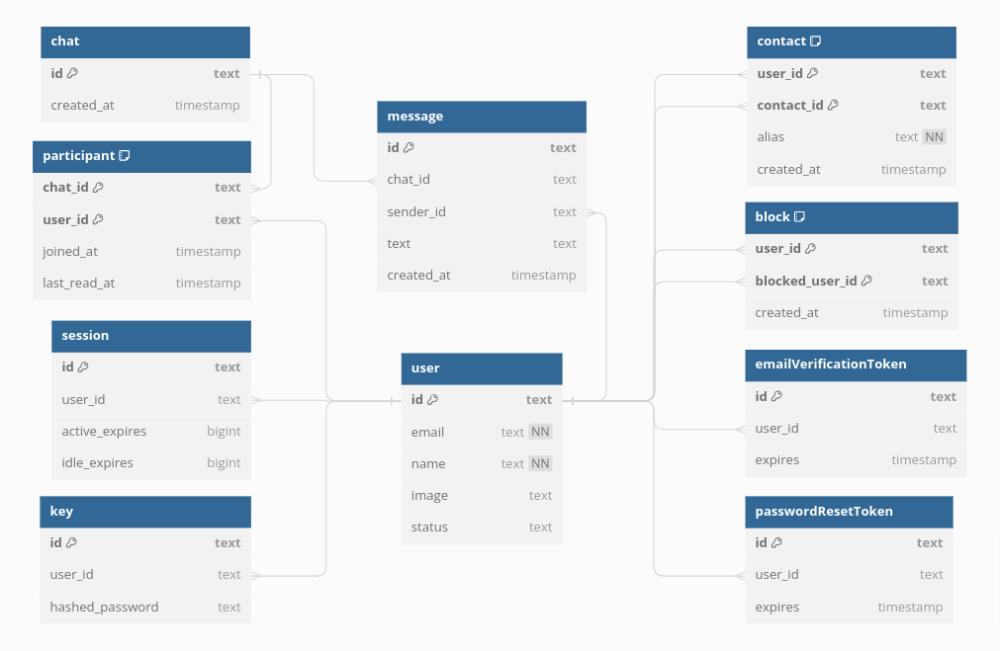

# BOBLE Web Chat

Chat with your friends and family from any device.

## Table of Contents

- [Tech and tools](#tech-and-tools)
- [External services](#external-services)
- [Project structure](#project-structure)
- [Installation](#installation)
- [Environment variables](#environment-variables)
- [Database setup](#database-setup)
- [Email setup](#email-setup)
- [Developing](#developing)
- [Deployment](#deployment)
- [List of commands](#list-of-commands)

## Tech and tools

**App**
- [Svelte](https://svelte.dev/): Front-end library that compiles declarative components into fast and lean web apps.
- [SvelteKit](https://kit.svelte.dev/): Framework for rapidly developing robust, performant web applications using Svelte. 
- [TailwindCSS](https://tailwindcss.com/): Utility-first, component driven CSS framework.

**WebSocket**
- [Socket.io](https://socket.io/): Library that enables low-latency, bidirectional and event-based communication between a client and a server.

**Database**
- [SQLite](https://www.sqlite.org/): Small, fast, self-contained, high-reliability, full-featured, SQL database engine.
- [Better-sqlite3](https://github.com/WiseLibs/better-sqlite3): The fastest and simplest library for SQLite3 in Node.js.
- [DrizzleORM](https://orm.drizzle.team/): TypeScript ORM that feels like writing SQL.

**Authentication**
- [Lucia](https://lucia-auth.com/): Simple and flexible auth library for TypeScript.

**Email**
- [Nodemailer](https://nodemailer.com/): Send emails from Node.js.
- [Svelte-email](https://svelte-email.vercel.app/docs/overview/svelte-email): Build emails using Svelte components.

**Testing**
- [Vitest](https://vitest.dev/): Next generation testing framework powered by Vite.
- [Playwright](https://playwright.dev/): Reliable end-to-end testing for modern web apps. 

## External services

- [SendGrid](https://sendgrid.com/): SMTP provider.
- [Giphy](https://developers.giphy.com/): GIF & sticker API.
- [Amazon S3](https://aws.amazon.com/s3/): Object storage.

## Project structure

```
/
├── doc/
│   └── Documentation images.
├── drizzle/
│   └── SQL migrations.
├── tests/
│   └── Tests.
├── s3/
│   └── Fake S3 server for development.
├── static/
│   └── Static assets to be served.
├── src/
│   ├── lib/
│   │   ├── auth/
│   │   │   └── Authentication using lucia.
│   │   ├── db/
│   │   │   └── Database config, schemas and queries using drizzle.
│   │   ├── socket/
│   │   │   └── WebSocket server using socket.io. 
│   │   ├── email/
│   │   │   └── Email config, templates and functions.
│   │   ├── file-upload/
│   │   │   └── File uploads using Amazon S3.
│   │   ├── mood/
│   │   │   └── GIF and sticker search using Giphy.
│   │   ├── ui/
│   │   │   └── Reusable UI components.
│   │   ├── actions/
│   │   │   └── Reusable element behaviors.
│   │   └── utils/
│   │       └── Helper functions.
│   └── routes/
│       └── Routes of your application and co-located components and files.
│   
└── Config files.
```

[Reference](https://kit.svelte.dev/docs/project-structure)

## Installation

Clone this repository:

```
git clone https://github.com/marioperezhurtado/boble2.git
cd boble2
```

Install dependencies:

```
npm install
```

## Environment variables

To run this project, you will need to add the following environment variables to your `.env` file

```
# Private
# Oauth providers
GITHUB_ID=""
GITHUB_SECRET=""

# Email
SENDGRID_API_KEY=""
SENDER_ADDRESS=""
SENDER_NAME=""

# GIF search
GIPHY_API_KEY=""

# Public
PUBLIC_SITE_URL="http://localhost:5173"
```

You can create a copy of the `.env.example` file to `.env` and populate it with your secrets.

```
cp .env.example .env
```

## Database setup

This project uses [SQLite](https://www.sqlite.org/index.html) with [better-sqlite3](https://www.sqlite.org/index.html), and [DrizzleORM](https://orm.drizzle.team/).

Your database will be stored in a single `sqlite.db` file at the root of your project, and your SQL migrations will be stored under the `drizzle/` folder.

The first time you run this project, and every time you make a change in your db schema, you will need to run the following commands to apply changes:

Generate a SQL migration file:

```
npm run db:generate
```

Push the changes to your database (or create one if it doesn't exist yet):

```
npm run db:push
```

You can check your tables and data using drizzle studio:

```
npm run db:studio
```



## Email setup

This project uses [Nodemailer](https://nodemailer.com/) to send emails, and [SendGrid](https://sendgrid.com/) as a SMTP provider.

There are several alternatives that you could use as SMPT provider ([Mailgun](https://www.mailgun.com/), [AWS SES](https://aws.amazon.com/es/ses/), etc).

If you choose to use SendGrid:

- Create your account.
- Create a verified single sender. (You can choose a real email, or setup your domain, e.g. noreply@your-domain.com)
- Create your API key.
- Populate your .env.

[Reference](https://midnightgamer.medium.com/how-to-use-sendgrid-with-nodemailer-to-send-mails-a289f30af622)

If you choose a different provider, you might need to change the email config at
`src/lib/email/email.ts`.

## Developing

Once you've created a project and installed dependencies with npm install *(or
pnpm, yarn, bun etc)*, populated your environment variables and followed the
previous steps,

Start a development server:

```
npm run dev
```

Start a WebSocket server:

```
npm run socket
```

Start a fake S3 server:

```
npm run s3
```

## Deployment

TBD...

## List of commands

| Command | Description | 
| -------- | -------- | 
| dev | Start a development server on port 5173 | 
| socket | Start a websocket server on port 8000 |
| s3 | Start a fake S3 server on port 5000 |
| build | Create a production version of your app |
| preview | Preview your production build |
| check | Run diagnostic checks |
| lint | Lint your project |
| format | Format your project |
| db:generate | Generate a SQL migration file |
| db:push | Push your changes to your database |
| db:studio | Launch a visual editor for your database on port 4983 |
| test | Run all tests |
| test:unit | Run unit tests |
| test:integration | Run integration tests |
